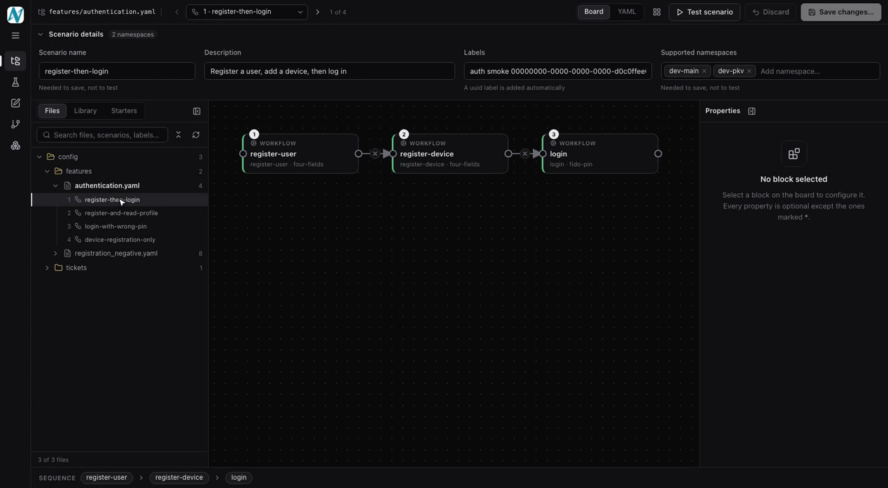
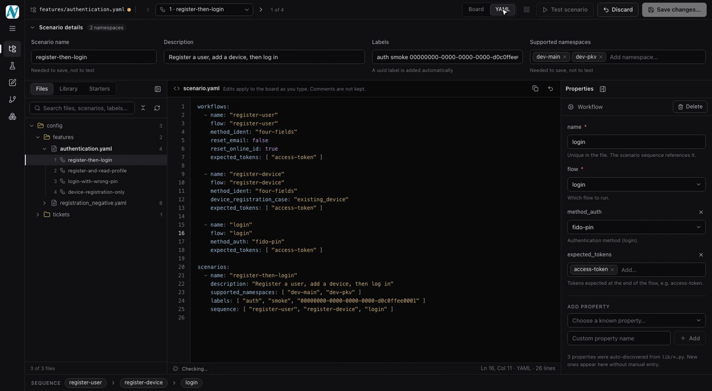
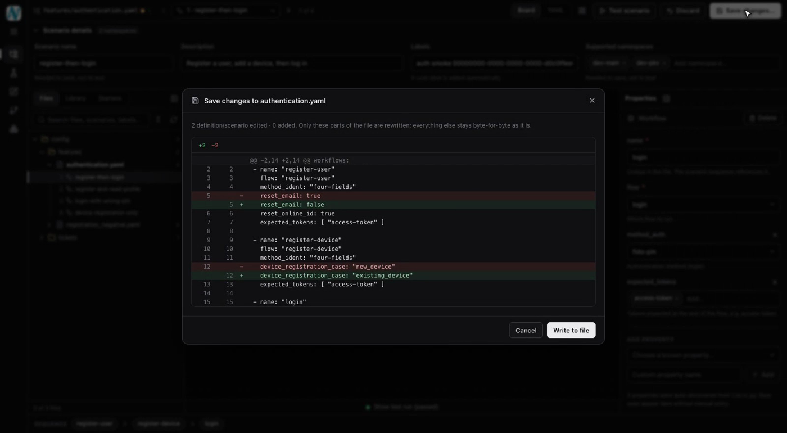
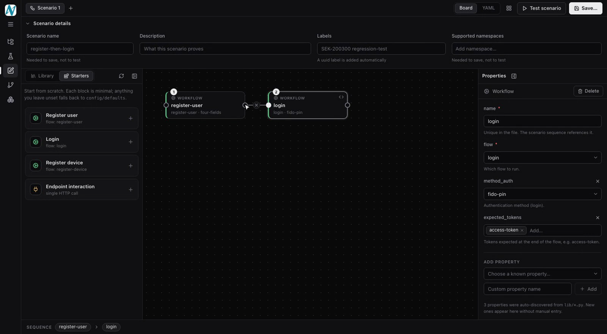
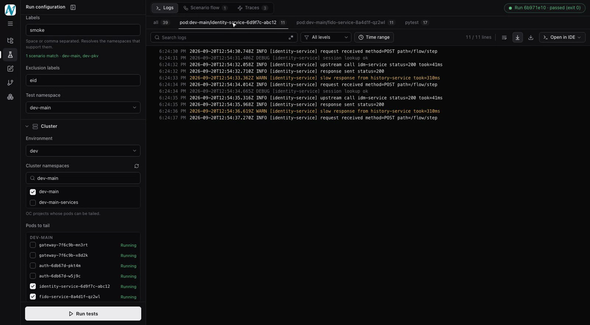
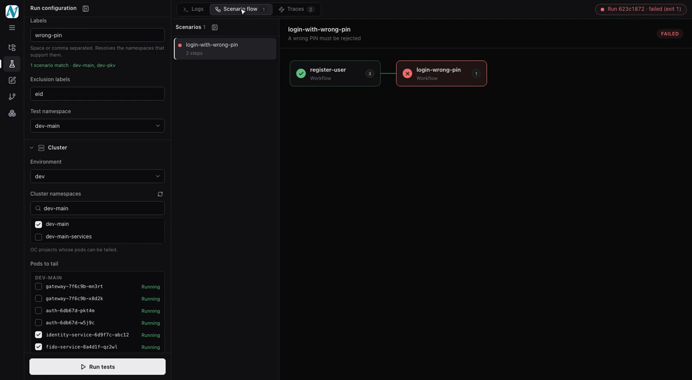
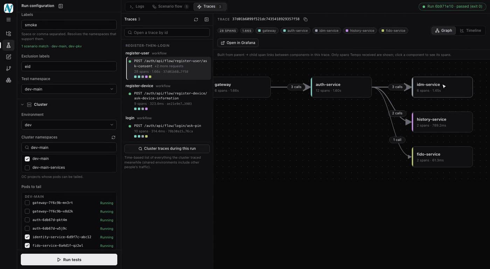
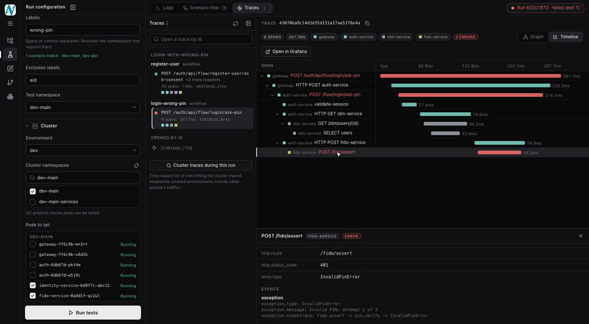
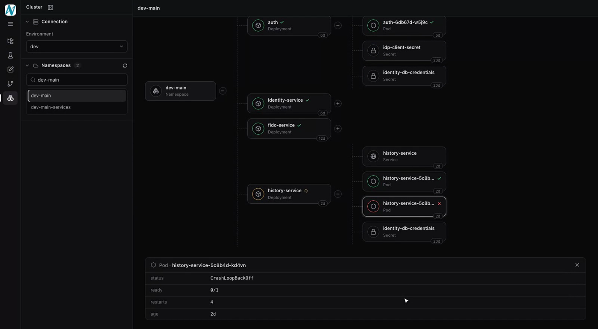
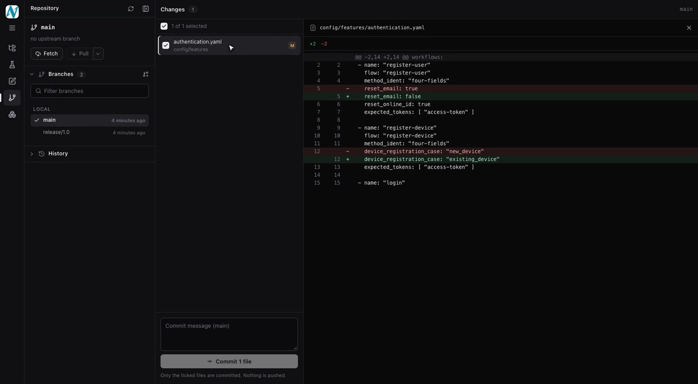

# Nevis Test Dashboard

Grafana-style web UI for running the nevis integration tests and watching pod
+ pytest logs live. Standalone tool that
talks to `oc`/`ssh` and `pytest` directly.

## Demo

[](docs/media/nevis-dashboard-demo.mp4)

**[Watch the 5-minute walkthrough](docs/media/nevis-dashboard-demo.mp4)** (narrated, MP4).

| | |
|---|---|
| <br>**Explorer**: existing scenarios as a visual flow, edited in place | <br>**YAML editor**: edit the config directly, synced with the board |
| <br>**Save changes**: the exact YAML diff before anything is written | <br>**Create new test**: build a scenario from blocks |
| <br>**Run tests**: trigger a scenario by label, tail pod logs live | <br>**Scenario flow**: the failing step, marked where it stopped |
| <br>**Tracing**: service graph for every workflow | <br>**Tracing**: the failing span, its status and exception |
| <br>**Deployments**: pods, services and secret keys per namespace | <br>**Git**: real YAML diffs, branch and commit |

## Requirements

- Node 18+ (20 recommended) and git.
- The integration-test project checked out locally (the folder with `integration_test.py` and `config/`), with its Python venv set up so `pytest` runs.
- Optional: `oc` (pod logs, deployments, tracing) and `ssh` (devtest cluster).

The dashboard is a separate tool. It never edits the project's Python code, `run.sh` or `conftest.py`. It reads `config/**/*.yaml` and `lib/*.py`, writes scenario YAML only when you save, and spawns the project's own `pytest`.

## Start

From a clone of this repo:

```bash
npm install && npm run build      # once
node bin/nevis-dashboard.js --root /path/to/nevis-integration-tests --open
```

Or, with the background daemon script:

```bash
NEVIS_TESTS_ROOT=/path/to/nevis-integration-tests ./start.sh
./stop.sh
```

`--root` can be omitted when the dashboard sits inside the project folder (as `test-dashboard/`) or is started from inside it. If the project can't be found it exits with a message saying so.

| Setting | Flag / env | Default |
|---|---|---|
| Test project | `--root` / `NEVIS_TESTS_ROOT` | parent folder, else current directory |
| Port | `--port` / `DASHBOARD_PORT` | 4570 |
| pytest binary | `NEVIS_PYTEST` | `<root>/.venv/bin/pytest`, else `pytest` on PATH |
| Devtest ssh | `SSH_HOST`, `SSH_USER`, `SSH_KEY` | none (fill in the UI) |
| Tempo / Grafana | `TEMPO_URL`, `GRAFANA_URL` | `oc port-forward` to the observability namespace |

Open http://localhost:4570

## What it does

- Pick cluster env (`dev` = direct `oc`, `devtest` = via ssh bastion, same
  defaults as `run.sh`), OC project, test namespace, labels, exclusion
  labels.
- "fetch pods" lists pods in the chosen project so you can checkbox which
  ones to tail.
- "Run tests" spawns `pytest --labels ... --namespaces ... --exclusion-labels ...`
  from the repo's `.venv`, and starts `oc logs -f <pod> --since=1s` (or the
  ssh equivalent) for every selected pod, all streamed to the browser over a
  websocket in real time.
- Each log source (pytest, each pod, and a merged "all" view) gets its own
  panel with search (plain text or regex), log-level filter, time-range
  filter, autoscroll toggle, and a download button.
- Run history is kept in the server's memory for the life of the process, so
  you can reopen a past run's logs while the dashboard is up.

## Dev mode

```bash
npm install && npm start                    # port 4570 (needs a built client)
cd client && npm install && npm run dev     # port 5173, proxies /api and /ws
```

## Create test case tab

Visual scenario builder. Drag building blocks (register user / login / register
device / endpoint interaction) or any predefined workflow/endpoint from the repo
onto the canvas, configure their properties in the right-hand panel, connect
them with the ports (right dot -> next block's left dot), then **Save test
case** and enter the ticket name.

- Writes exactly one new file: `config/tickets/<ticket>_scenarios_config.yaml`.
  pytest already globs `config/tickets/*.yaml`, so no code change is needed.
- Never overwrites an existing file, and adds no comments to what it writes - just the config.
- A uuid label is added to each scenario automatically, matching repo convention.
- After saving, it runs `pytest --dry-run` (no requests) to prove the scenario is discovered.
- **Test scenario** runs the draft through real pytest *before* anything is saved (real requests, like the
  Tests tab). It uses a temporary `config/tickets/zz_dashboard_draft_*.yaml` that is deleted when the run ends.
- **Add to existing file** appends the new scenario (plus any workflows/endpoints it needs) to a chosen
  scenario file. Existing content is never rewritten; identical blocks already in that file are reused,
  conflicting ones are rejected, and the result is re-parsed before anything is written.
- Properties are discovered automatically: documented defaults, namespace defaults, and every
  `self.config.get('key', default)` found by scanning `lib/**/*.py` (marked "auto"). The tab re-reads the
  repo when opened/focused, or via the refresh button.

## UI notes

- Left navigation (hamburger / `Ctrl/⌘ B` to collapse) replaces the top bar; every side panel, the scenario list
  and the test-run dock are resizable by dragging their edge (double-click resets) and collapsible. Sizes are remembered.
- Controls (selects, date-time pickers, checkboxes, menus) are custom components, not browser defaults - see `client/src/ui.jsx`.
- Log panels can be downloaded or opened directly in a locally installed IDE (VS Code, Cursor, IntelliJ, PyCharm, Sublime, Zed, ...
  or the system default editor). The server writes the (filtered) log to `.run/logs/` and launches the editor.
- **Test scenario** in the builder only needs a valid chain of blocks; the namespace to run against is chosen in the dialog.

## Tracing

The Tests tab (and the builder's test panel) has a **Traces** view: the request traces of a run, drawn as a
service graph (test client → nevisproxy → auth → fido …) or a span timeline, with span details.

- **How traces are linked:** the suite itself injects a W3C `traceparent` header (branch `SEK-200299-traceparent-headers`,
  `lib/tracing.py`): every workflow and endpoint interaction runs as one trace, and `conftest.py` logs its 32-hex `trace_id` per step
  in the `[SCENARIO-CONFIGURATION]` line when the test ends. The dashboard reads those ids - it adds nothing to the requests.
  On a checkout without `lib/tracing.py` the Traces view says so (older builds log a plain uuid, which is ignored).
  Ids therefore appear per test as it finishes, not per request while it runs.
- **Where traces come from:** Tempo (`svc/tempo-sekidp` in `dev-observability`) through a read-only `oc port-forward` that the
  server starts on demand (`localhost:13200`; an existing forward on that port is reused, or set `TEMPO_URL`). Only `env=dev` is supported.
- **Deep links:** clicking a trace id in the logs slides the trace timeline in from the right (logs keep their scroll position and the
  clicked line stays highlighted); **Open in Traces** there jumps to the full view. Trace ids in the logs (the logged `trace_id`, `traceparent` headers, 32-hex ids on lines mentioning "trace", span ids next to a trace id) are
  clickable and jump to the trace/span; the scenario flow step details have a **View trace** button; any trace can be opened by id.
- **Open in Grafana** starts a tunnel to `svc/sekidp-service` on `localhost:13000` and opens Explore for the trace id
  (sign in there as usual; override with `GRAFANA_URL`).
- Components need a few seconds to export spans, so a run's traces are re-checked automatically for about a minute after it ends.

## Explorer

Browse every scenario file under `config/` like an IDE tree (search matches file names, scenario names, labels and
workflow/endpoint names). Opening a file shows each of its scenarios as an editable flow, exactly like *Create new test*:
edit properties, add blocks from the library, **Test scenario** (temporary draft, real requests, nothing written), then
**Save changes…** shows the real YAML diff before writing. Saving patches only the definitions/scenarios you changed;
the rest of the file (comments, spacing, quoting) stays byte-for-byte. A definition shared by several scenarios of the file is
edited in all of them at once. Keys the editor does not model (e.g. `clear_output`) are never touched.

## Git

The integration-tests repo from the dashboard: current branch and ahead/behind, switch branch (remote-only branches get a local
tracking branch), create a branch, fetch, pull (fast-forward only by default; rebase/merge selectable), the changed files with
the real unified diff against HEAD, and commit exactly the ticked files. Nothing is pushed. Checkout and pull are refused
while a test run is in progress.

